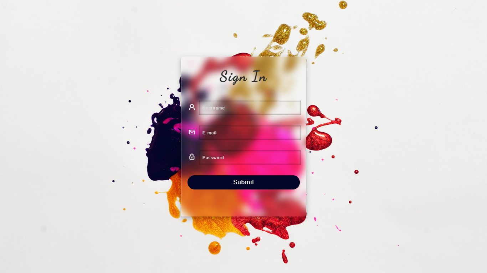

<h1 style = "text-align:center">Tela de Login</h1>

<h2>Projeto</h2>

Tela de login feita com HTML5 e CSS3, utilizando uma técnica de GlassMorphism. 
Glassmorphism é uma técnica para replicar um aspecto de vidro ao elemento.

<h2>Tecnologias utilizadas</h2>

  